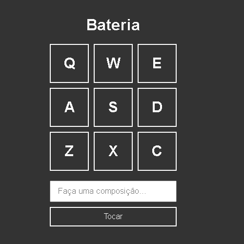

<div align='center'>
  
</div>

## Sobre o projeto 💬

O **Bateria** é uma aplicação WEB Playback de bateria, podendo criar sua própria composição ao pressionar as teclas

## Funcionalidades 🧠

A aplicação contém as seguintes funcionalidades:

### Index.html 📕

- [x] Reproduzir o som a apertar a tecla correspondente que mostra na tela
- [x] Criar sua Própria Composição

## Pré-requisitos
  Antes de começar, é bom ter instalado um editor para trabalhar com o codigo como o [VSCode](https://code.visualstudio.com/)

### Rodando o Projeto 📖

```bash
# Clone para este repositório
$ git clone <https://github.com/Pedro-AugusCoelho/Bateria.git>
 
```

## Tecnologias 🛠

Desenvolvido utilizando as seguintes tecnologias:

- [HTML5](https://www.w3schools.com/html/default.asp)
- [CSS3](https://www.w3schools.com/css/)
- [JavaScript](https://www.javascript.com/)

****************

<p align="center">Feito por: Pedro Augusto 🧑🏽🤙🏽</p>
